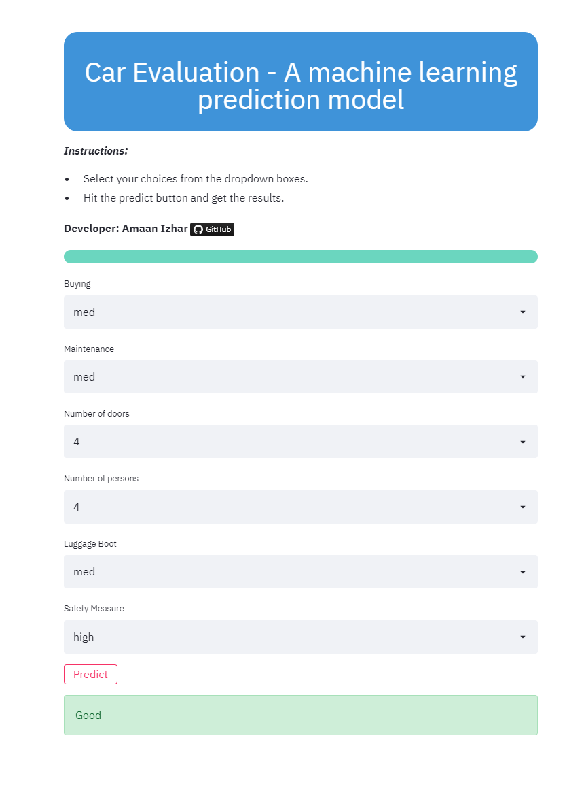

# Car Evaluation
  
  
  
  
  
  
## Description
   An end to end machine learning project for evaluating car acceptability based on various features. Streamlit is used for real-time predictions. This application
   can be deployed on heroku for real-world use. Hope you like it!

## Screenshots Of The App


## Steps Taken In This Project
- Data Collection
- EDA & Visualization
- Model selection & building it.
- Evaluation of the models.
- Saving the models.
- Application program for real time usage.

## Installation And Usage
1. Installation
   - Download/clone this repository. Then open terminal (make sure you are in the project's directory).
   - Create a virtual environment using the command ````py -m venv yourVenvName```` and activate it using ````yourVenvName\Scripts\activate.bat````.
   - Then run the following command ````pip install -r requirements.txt````. With this, all the dependencies will be installed in your virtual environment. 
> **Note:** *If any dependency is missing or an error shows up, install it using ````pip install moduleName````*.

2. Usage
   - Open your project folder and go to the terminal and activate your virtual environment. Then type ````streamlit run src\main.py```` and the app will open in your web 
   browser. Now you can interact with it or play with the code and add your own features. Also you can play around with jupyter notebook if you wish.
